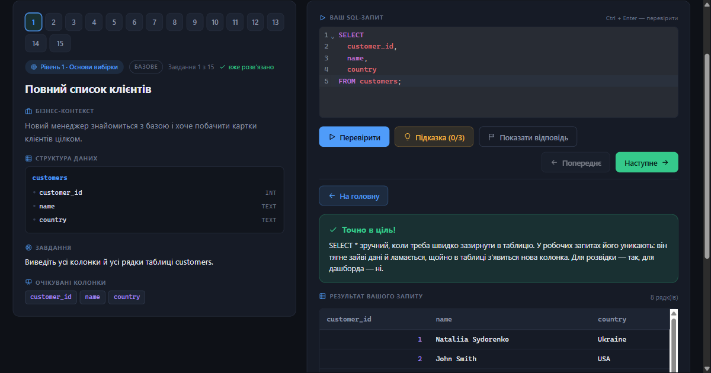

# SQL-тренажер для дата-аналітики

[](https://github.com/NataliiaYarema/sql-trainer/actions/workflows/ci.yml)

**[Відкрити тренажер →](https://sql-trainer-zeta.vercel.app/)**



## Про тренажер

Веб-тренажер для практики SQL: 125 завдань, розкладених по 8 рівнях, з бізнес-контекстом і трьома підказками. Після перевірки тренажер демонструє вердикт — правильно чи ні. Варіант правильного запиту з поясненнями можна також переглянути, натиснувши кнопку «Показати відповідь».

Запити виконуються справжнім **PostgreSQL** прямо в браузері (через [PGlite](https://pglite.dev), скомпільований у WebAssembly). Це не емуляція й не спрощений діалект, а той самий Postgres, який використовують у реальних проєктах: з `DATE_TRUNC`, `EXTRACT`, віконними функціями та його ж повідомленнями про помилки.

Ваш запит перевіряється за результатом, який він повернув, а не за текстом. Якщо рішення правильне, воно буде зараховане незалежно від того, як саме написаний SQL.

Сервер не потрібен: база запускається прямо у вкладці браузера й створюється знов після кожного завантаження сторінки. Дані доступні лише для читання, тому `INSERT`, `UPDATE`, `DELETE` чи `DROP` не змінять навчальну базу.

## Як почати

Відкрийте [тренажер](https://sql-trainer-zeta.vercel.app/) і виберіть рівень — усі вісім доступні
одразу, реєстрація не потрібна. Перший запит на сторінці відпрацьовує довше за наступні: браузер
завантажує PostgreSQL і створює таблиці.

## Рівні

| Рівень | Тема                   | Про що                                                                                      |
| ------ | ---------------------- | ------------------------------------------------------------------------------------------- |
| 1      | Основи вибірки         | `SELECT`, `FROM`, `WHERE`, `ORDER BY`, `LIMIT`, `DISTINCT`                                  |
| 2      | Групування й агрегація | `GROUP BY`, `HAVING`, `COUNT`, `SUM`, `AVG`, `MIN`, `MAX`                                   |
| 3      | Об'єднання таблиць     | `JOIN`, `INNER JOIN`, `LEFT JOIN`, `ON`, `USING`                                            |
| 4      | Підзапити й CTE        | `WITH`, `AS`, `IN`, `NOT IN`, `NOT EXISTS`                                                  |
| 5      | Віконні функції        | `OVER`, `PARTITION BY`, `ROW_NUMBER`, `RANK`, `DENSE_RANK`, `LAG`, `LEAD`, `NTILE`          |
| 6      | Дати та рядки          | `DATE_TRUNC`, `EXTRACT`, `INTERVAL`, `AGE`, `TO_CHAR`, `TRIM`, `INITCAP`, `SPLIT_PART`      |
| 7      | Умови й множини        | `CASE`, `WHEN`, `THEN`, `ELSE`, `END`, `COALESCE`, `NULLIF`, `UNION`, `INTERSECT`, `EXCEPT` |
| 8      | Аналітичні кейси       | `WITH`, `DATE_TRUNC`, `COUNT`, `DISTINCT`, `FILTER`, `LAG`, `NTILE`                         |

Кожен рівень супроводжує сторінка теорії з тими самими конструкціями: короткий підсумок,
приклади SQL на реальних даних і типові пастки.

Кожна конструкція, названа в заголовку теми, має власний приклад, а поруч із кожним прикладом
є кнопка «Виконати запит»: вона переносить його в пісочницю й виконує, тож результат
видно на справжніх даних.

Всередині кожного рівня складність зростає за однаковою схемою: **базові завдання → середні →
комплексні**. Тип показано позначкою на картці завдання.

Комплексне завдання наприкінці рівня зводить разом усе, що було до нього. Наприклад, на рівні 2 це «категорії, де середня ціна понад 100 і водночас більше 5 товарів», а на рівні 5 — накопичена сума витрат клієнта від замовлення до замовлення разом із сумою попереднього.

На рівні 8 чотири завдання («Аналіз конверсії користувачів») утворюють наскрізний кейс: кожне
наступне будується на висновку з попереднього, а картка завдання показує бейдж
«Кейс: Аналіз конверсії користувачів — крок N».

## Як це працює

Тренажер починається з екрана вибору рівня. Усі вісім рівнів відкриті одразу, тому можна перейти до потрібної теми, а не проходити їх послідовно. Після вибору відкриваються лише завдання цього рівня. Повернутися до списку можна будь-коли кнопкою в шапці.

Картка рівня показує відсоток виконання, а детальна статистика доступна в дашборді. Написаний, але ще не перевірений SQL зберігається окремо для кожного завдання, тому можливе повернення до нього навіть після перезавантаження сторінки.

Кнопка «Пісочниця» в шапці відкриває редактор: та сама база, будь-який запит, без завдання й перевірки. Саме туди веде «Виконати запит» зі сторінки теорії.

Кнопка «Мій прогрес» відкриває дашборд зі статистикою: скільки завдань уже розв'язано, де ви зупинилися минулого разу (із кнопкою «Продовжити»), які теми вже освоєні, у яких конструкціях виникає найбільше помилок — біля них є кнопка «потренувати», що веде просто до потрібного завдання, — і які завдання варто повторити. Тема вважається освоєною, лише коли розв'язані всі її завдання рівня.

Наприкінці рівня екран «Ти тепер вмієш» перелічує здобуті вміння — відмітка стоїть лише там, де тема відпрацьована повністю.

## Структура бази даних

П'ять основних таблиць — `employees`, `customers`, `orders`, `products`, `order_items` —
підібрані так, щоб покривати навчальні сценарії: є співробітник без департаменту (`IS NULL`),
клієнт без замовлень (`LEFT JOIN`), товари, яких ніхто не купував (anti-join), і посилання
`orders.manager_id` на продавця (self-join та звіти по менеджерах). До них додається
`raw_contacts` — таблиця з неочищеними контактами для вправ із рядковими функціями.

Три аналітичні таблиці — `app_users`, `app_events` і `app_purchases` (рівень 8) — генеруються
за допомогою `generate_series` і `md5` як джерела псевдовипадковості.

Колонки `hire_date` і `order_date` мають справжній тип `DATE`, а не текст, тому з ними працює
арифметика дат і `EXTRACT`.

## Зберігання прогресу

Тренажер працює локально. PostgreSQL запускається в браузері, а прогрес, історія спроб,
нотатки та чернетки зберігаються у Local Storage.

Якщо очистити дані браузера або відкрити тренажер на іншому пристрої, прогрес почнеться з нуля.

Нотатку до завдання можна написати під самим завданням, а потім виправити в списку на
екрані «Мої нотатки» — текст там редагується на місці.

Скинути все можна й самостійно: кнопка «Очистити» на дашборді стирає прогрес, історію спроб і
чернетки. Нотатки також можна видалити — як кожну окремо, так і всі разом через кнопку
«Видалити всі».

Поточна архітектура дозволяє за потреби додати авторизацію та синхронізацію прогресу між
пристроями. Зараз це свідомо локальний застосунок — без акаунтів, сервера та залежності від
інтернет-з'єднання.

## Запуск локально

```bash
npm install
npm run dev
```

Після запуску Vite виведе адресу локального сервера (зазвичай `http://localhost:5173`). Якщо цей
порт зайнятий, буде автоматично використано наступний вільний.

## Інші команди

```bash
npm test          # перевірки: завдання, звірка результатів, стан гри, UI
npm run lint      # ESLint
npm run format    # Prettier переписує файли (format:check — лише перевіряє)
npm run build     # продакшн-збірка у dist/
npm run preview   # перегляд зібраної версії
```

## Як додати завдання (для розробників)

Завдання лежать у `src/tasks/level1.js` … `level8.js`. Скопіюйте об'єкт-сусід і замініть поля. Обов'язкові: `id`, `level`, `tier` (`basic` / `medium` / `complex`), `title`, `context`, `schemaDescription`, `setupSql`, `taskText`, `expectedOutputColumns`, `referenceSql`, три `hints` і `explanation`.

Описи схем беріть з [src/tasks/schemas.js](src/tasks/schemas.js), а не пишіть рядком — тоді зміна колонки в даних не потребуватиме правок у десятках завдань.

Після додавання запустіть `npm test`. Перевіряється, що еталонний запит виконується проти `setupSql`, повертає хоча б один рядок, а назви його колонок точно збігаються з `expectedOutputColumns`. Окремо звіряється, що склад рівня відповідає `LEVEL_PLAN`, що складність усередині рівня не спадає, і що кожна таблиця, згадана в `referenceSql`, справді описана в `schemaDescription`.

Запити пишіть діалектом PostgreSQL: `DATE_TRUNC`, `EXTRACT`, `TO_CHAR` доступні, а `strftime` чи `julianday` із SQLite — ні. Тести виконують кожен еталонний запит справжнім Postgres, тож помилка діалекту не пройде непоміченою.
