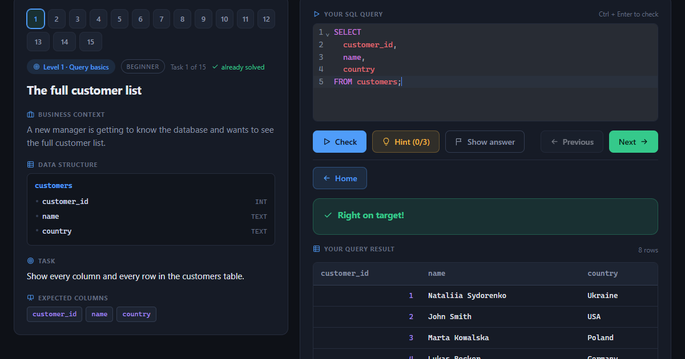
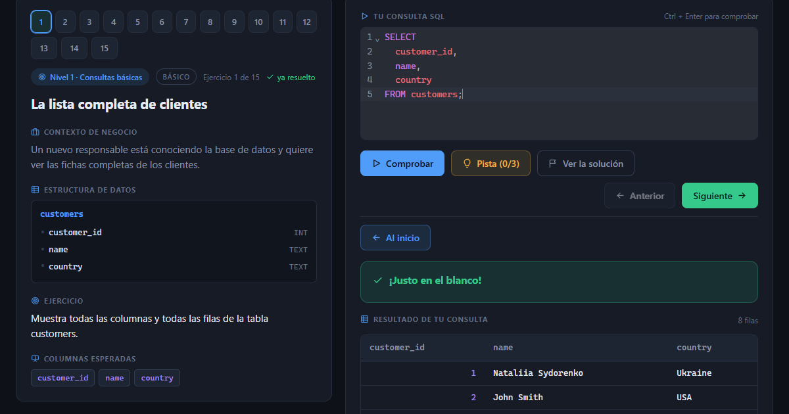
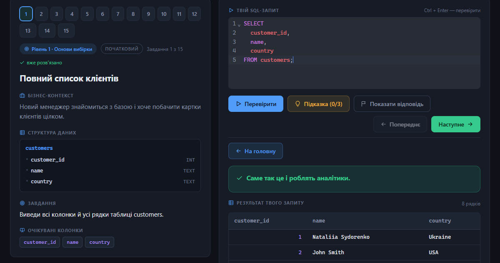

[](https://github.com/NataliiaYarema/sql-trainer/actions/workflows/ci.yml)

**[English](#sql-trainer-for-data-analysts) · [Español](#entrenador-de-sql-para-analistas-de-datos) · [Українська](#sql-тренажер-дата-аналітика)**

---

# SQL Trainer for Data Analysts



**[Open the trainer →](https://sql-trainer-zeta.vercel.app/)**

## About the trainer

A web trainer for practising SQL: 125 tasks across 8 levels, each with a business context and three hints. After a check the trainer shows a verdict — correct or not. A reference query with an explanation is available too, behind the “Show answer” button.

Queries run on real **PostgreSQL** right in the browser (via [PGlite](https://pglite.dev), compiled to WebAssembly). It is not an emulation or a simplified dialect but the same Postgres used in real projects: with `DATE_TRUNC`, `EXTRACT`, window functions and its own error messages.

Your query is checked by the result it returns, not by its text. A correct solution counts no matter how the SQL is written.

No server is needed: the database starts right in the browser tab and is created afresh on every page load. The data is read-only, so `INSERT`, `UPDATE`, `DELETE` or `DROP` will not change the training database.

## Languages

The interface, all 125 tasks and the theory are available in three languages: English, Spanish and Ukrainian. Choose the language in the drop-down list in the top-right corner of the header — the page switches at once, without reloading, and your progress stays where it was.

On the very first visit the trainer opens in English. SQL, table and column names and the data itself are the same in every language.

## Getting started

Open the [trainer](https://sql-trainer-zeta.vercel.app/) and choose a level — all eight are available at once, no sign-up needed. The first query on the page takes longer than the next ones: the browser loads PostgreSQL and creates the tables.

## Levels

| Level | Topic                    | What it covers                                                                         |
| ----- | ------------------------ | -------------------------------------------------------------------------------------- |
| 1     | Query basics             | `SELECT`, `FROM`, `WHERE`, `ORDER BY`, `LIMIT`, `DISTINCT`                             |
| 2     | Grouping and aggregation | `GROUP BY`, `HAVING`, `COUNT`, `SUM`, `AVG`, `MIN`, `MAX`                              |
| 3     | Joining tables           | `JOIN`, `INNER JOIN`, `LEFT JOIN`, `ON`, `USING`                                       |
| 4     | Subqueries and CTEs      | `WITH`, `AS`, `IN`, `NOT IN`, `NOT EXISTS`                                             |
| 5     | Window functions         | `OVER`, `PARTITION BY`, `ROW_NUMBER`, `RANK`, `DENSE_RANK`, `LAG`, `LEAD`, `NTILE`     |
| 6     | Dates and strings        | `DATE_TRUNC`, `EXTRACT`, `INTERVAL`, `AGE`, `TO_CHAR`, `TRIM`, `INITCAP`, `SPLIT_PART` |
| 7     | Conditions and sets      | `CASE`, `COALESCE`, `NULLIF`, `UNION`, `INTERSECT`, `EXCEPT`                           |
| 8     | Analytics case studies   | `WITH`, `DATE_TRUNC`, `COUNT`, `DISTINCT`, `FILTER`, `LAG`, `NTILE`                    |

Every level comes with a theory page on the same constructs: a short summary, SQL examples on real data and common pitfalls.

Every construct named in a topic's title has its own example, and next to each example there is a “Run query” button: it moves the example into the sandbox and runs it, so the result is visible on real data.

Within every level the difficulty grows the same way: **Beginner → Intermediate → Advanced**. The tier is shown by a label on the task card.

The advanced task at the end of a level brings together everything before it. For example, on level 2 it is “categories whose average price is above 100 and that have more than 5 products at the same time”, and on level 5 it is a customer's spending accumulated from order to order together with the amount of the previous one.

On level 8 four tasks (“User conversion analysis”) form a running case study: each next one builds on the conclusion of the previous, and the task card shows the badge “Case study: User conversion analysis — step N of 4”.

## How it works

The trainer starts with the level selection screen. All eight levels are open at once, so you can go straight to the topic you need instead of working through them in order. After choosing, only that level's tasks open. You can return to the list any time with the button in the header.

A level card shows the completion percentage, and detailed statistics are on the dashboard. SQL that you have written but not yet checked is saved separately for every task, so you can come back to it even after reloading the page.

The “Sandbox” button in the header opens an editor: the same database, any query, no task and no check. That is where “Run query” from a theory page leads.

The “My progress” button opens a dashboard with statistics: how many tasks are already solved, where you stopped last time (with a “Continue” button), which topics are already mastered, in which constructs the most mistakes happen — with a “practise” button next to them that leads straight to the right task — and which tasks are worth repeating. A topic counts as mastered only when all of its tasks on the level are solved.

At the end of a level the “What you can do now” screen lists the skills gained — a tick appears only where a topic has been fully worked through.

## Certificate

Completing all levels of the trainer earns a certificate:

- **Certificate** — at least 90% of the tasks on every level are solved (14 of 15, and 18 of 20 on level 3).
- **Certificate with Distinction** — all 125 tasks are solved, and “Show answer” was never pressed.

The conditions, and how many tasks are still missing on each level, are visible on the home screen and on the dashboard. As soon as the condition is met, a “Get your certificate” button appears under the check result. On the certificate screen you can type your name and press “Save as PDF”. The certificate is saved in the interface language (English, Spanish or Ukrainian).

A regular certificate is upgraded to the Certificate with Distinction as soon as its condition is met. The “Clear” button on the dashboard resets the certificate too.

Progress is stored only in the browser, so the certificate is a personal recognition of the completed course, not an official document.

## Database structure

Five main tables — `employees`, `customers`, `orders`, `products`, `order_items` — are chosen to cover the training scenarios: there is an employee without a department (`IS NULL`), a customer without orders (`LEFT JOIN`), products nobody has bought (anti-join), and the `orders.manager_id` reference to a salesperson (self-join and reports by manager). They are joined by `raw_contacts` — a table of uncleaned contacts for exercises with string functions.

Three analytics tables — `app_users`, `app_events` and `app_purchases` (level 8) — are generated with `generate_series`, using `md5` as the source of pseudo-randomness.

The `hire_date` and `order_date` columns have a real `DATE` type rather than text, so date arithmetic and `EXTRACT` work with them.

## Storing progress

The trainer works locally. PostgreSQL runs in the browser, and progress, attempt history, notes and drafts are kept in Local Storage.

If you clear the browser data or open the trainer on another device, progress starts from zero.

A note for a task can be written right under the task and later edited in the list on the “My notes” screen — the text is edited in place there.

You can also reset everything yourself: the “Clear” button on the dashboard erases progress, attempt history and drafts. Notes can be deleted too — each one separately or all at once with the “Delete all” button.

The current architecture allows adding sign-in and syncing progress between devices if needed. For now it is deliberately a local application — no accounts, no server and no dependency on an internet connection.

## Running locally

```bash
npm install
npm run dev
```

After start-up Vite prints the address of the local server (usually `http://localhost:5173`). If that port is taken, the next free one is used automatically.

## Other commands

```bash
npm test          # checks: tasks, result comparison, game state, UI
npm run lint      # ESLint
npm run format    # Prettier rewrites files (format:check only checks)
npm run build     # production build into dist/
npm run preview   # preview the built version
```

## Adding a task (for developers)

Tasks live in `src/tasks/level1.js` … `level8.js`. Copy a neighbouring object and replace the fields. Required: `id`, `level`, `tier` (`basic` / `medium` / `complex`), `title`, `context`, `schemaDescription`, `setupSql`, `taskText`, `expectedOutputColumns`, `referenceSql`, three `hints` and `explanation`.

The task text in `level*.js` is Ukrainian — it is the source. The English and Spanish versions live in `src/i18n/en/tasks/` and `src/i18n/es/tasks/`, keyed by the task `id`, and a new task needs a translation in both.

Take schema descriptions from [src/tasks/schemas.js](src/tasks/schemas.js) instead of writing them as a string — then a column change in the data will not require edits in dozens of tasks.

After adding a task, run `npm test`. It checks that the reference query runs against `setupSql`, returns at least one row, and that its column names exactly match `expectedOutputColumns`. It also checks that the level's composition matches `LEVEL_PLAN`, that difficulty does not decrease within a level, that every table mentioned in `referenceSql` is actually described in `schemaDescription`, and that the translations are complete.

Write queries in the PostgreSQL dialect: `DATE_TRUNC`, `EXTRACT`, `TO_CHAR` are available, while SQLite's `strftime` or `julianday` are not. The tests run every reference query on real Postgres, so a dialect mistake will not slip through.

---

# Entrenador de SQL para analistas de datos



**[Abrir el entrenador →](https://sql-trainer-zeta.vercel.app/)**

## Sobre el entrenador

Un entrenador web para practicar SQL: 125 ejercicios repartidos en 8 niveles, cada uno con un contexto de negocio y tres pistas. Tras la comprobación, el entrenador muestra un veredicto: correcto o no. También se puede ver una consulta de referencia con su explicación pulsando el botón «Ver la solución».

Las consultas se ejecutan en un **PostgreSQL** real directamente en el navegador (mediante [PGlite](https://pglite.dev), compilado a WebAssembly). No es una emulación ni un dialecto simplificado, sino el mismo Postgres que se usa en proyectos reales: con `DATE_TRUNC`, `EXTRACT`, funciones de ventana y sus propios mensajes de error.

Tu consulta se comprueba por el resultado que devuelve, no por su texto. Una solución correcta cuenta sin importar cómo esté escrito el SQL.

No hace falta servidor: la base de datos arranca en la propia pestaña del navegador y se crea de nuevo cada vez que se carga la página. Los datos son de solo lectura, así que `INSERT`, `UPDATE`, `DELETE` o `DROP` no cambiarán la base de práctica.

## Idiomas

La interfaz, los 125 ejercicios y la teoría están disponibles en tres idiomas: inglés, español y ucraniano. El idioma se elige en la lista desplegable de la esquina superior derecha de la cabecera: la página cambia al instante, sin recargarse, y el progreso se mantiene.

En la primera visita el entrenador se abre en inglés. El SQL, los nombres de tablas y columnas y los propios datos son los mismos en todos los idiomas.

## Cómo empezar

Abre el [entrenador](https://sql-trainer-zeta.vercel.app/) y elige un nivel: los ocho están disponibles desde el principio y no hace falta registrarse. La primera consulta de la página tarda más que las siguientes: el navegador carga PostgreSQL y crea las tablas.

## Niveles

| Nivel | Tema                    | De qué trata                                                                           |
| ----- | ----------------------- | -------------------------------------------------------------------------------------- |
| 1     | Consultas básicas       | `SELECT`, `FROM`, `WHERE`, `ORDER BY`, `LIMIT`, `DISTINCT`                             |
| 2     | Agrupación y agregación | `GROUP BY`, `HAVING`, `COUNT`, `SUM`, `AVG`, `MIN`, `MAX`                              |
| 3     | Combinar tablas         | `JOIN`, `INNER JOIN`, `LEFT JOIN`, `ON`, `USING`                                       |
| 4     | Subconsultas y CTE      | `WITH`, `AS`, `IN`, `NOT IN`, `NOT EXISTS`                                             |
| 5     | Funciones de ventana    | `OVER`, `PARTITION BY`, `ROW_NUMBER`, `RANK`, `DENSE_RANK`, `LAG`, `LEAD`, `NTILE`     |
| 6     | Fechas y cadenas        | `DATE_TRUNC`, `EXTRACT`, `INTERVAL`, `AGE`, `TO_CHAR`, `TRIM`, `INITCAP`, `SPLIT_PART` |
| 7     | Condiciones y conjuntos | `CASE`, `COALESCE`, `NULLIF`, `UNION`, `INTERSECT`, `EXCEPT`                           |
| 8     | Casos de analítica      | `WITH`, `DATE_TRUNC`, `COUNT`, `DISTINCT`, `FILTER`, `LAG`, `NTILE`                    |

Cada nivel va acompañado de una página de teoría sobre las mismas construcciones: un resumen breve, ejemplos de SQL con datos reales y trampas habituales.

Cada construcción nombrada en el título de un tema tiene su propio ejemplo, y junto a cada ejemplo hay un botón «Ejecutar consulta»: lleva el ejemplo a la zona de pruebas y lo ejecuta, así que el resultado se ve con datos reales.

Dentro de cada nivel la dificultad crece de la misma manera: **Básico → Intermedio → Avanzado**. El tipo se indica con una etiqueta en la ficha del ejercicio.

El ejercicio avanzado del final de un nivel reúne todo lo anterior. Por ejemplo, en el nivel 2 son «las categorías cuyo precio medio supera 100 y que a la vez tienen más de 5 productos», y en el nivel 5, el gasto acumulado de un cliente de pedido en pedido junto con el importe del anterior.

En el nivel 8, cuatro ejercicios («Análisis de la conversión de usuarios») forman un caso continuo: cada uno se apoya en la conclusión del anterior, y la ficha del ejercicio muestra la insignia «Caso: Análisis de la conversión de usuarios — paso N de 4».

## Cómo funciona

El entrenador empieza con la pantalla de elección de nivel. Los ocho niveles están abiertos desde el principio, así que se puede ir directamente al tema que interesa en lugar de recorrerlos en orden. Tras elegir, solo se abren los ejercicios de ese nivel. Se puede volver a la lista en cualquier momento con el botón de la cabecera.

La ficha de un nivel muestra el porcentaje completado, y las estadísticas detalladas están en el panel. El SQL escrito pero aún no comprobado se guarda por separado para cada ejercicio, así que se puede volver a él incluso después de recargar la página.

El botón «Zona de pruebas» de la cabecera abre un editor: la misma base de datos, cualquier consulta, sin ejercicio ni comprobación. Ahí es adonde lleva «Ejecutar consulta» desde una página de teoría.

El botón «Mi progreso» abre un panel con estadísticas: cuántos ejercicios están ya resueltos, dónde lo dejaste la última vez (con un botón «Continuar»), qué temas ya dominas, en qué construcciones aparecen más errores —junto a ellas hay un botón «practicar» que lleva directamente al ejercicio adecuado— y qué ejercicios conviene repetir. Un tema se considera dominado solo cuando están resueltos todos sus ejercicios del nivel.

Al final de un nivel, la pantalla «Lo que ya sabes hacer» enumera las habilidades conseguidas: la marca aparece solo donde un tema se ha trabajado por completo.

## Certificado

Al completar todos los niveles del entrenador se puede obtener un certificado:

- **Certificado**: resueltos al menos el 90 % de los ejercicios de cada nivel (14 de 15, y 18 de 20 en el nivel 3).
- **Certificado con distinción**: resueltos los 125 ejercicios sin pulsar ni una vez «Ver la solución».

Las condiciones, y cuántos ejercicios faltan todavía en cada nivel, se ven en la pantalla de inicio y en el panel. En cuanto se cumple la condición, bajo el resultado de la comprobación aparece el botón «Obtener el certificado». En la pantalla del certificado se puede escribir el nombre y pulsar «Guardar como PDF». El certificado se guarda en el idioma de la interfaz (inglés, español o ucraniano).

Un certificado normal pasa a ser con distinción en cuanto se cumple su condición. El botón «Borrar» del panel también reinicia el certificado.

El progreso se guarda solo en el navegador, así que el certificado es un reconocimiento personal por el curso completado, no un documento oficial.

## Estructura de la base de datos

Cinco tablas principales —`employees`, `customers`, `orders`, `products`, `order_items`— están elegidas para cubrir los escenarios de práctica: hay un empleado sin departamento (`IS NULL`), un cliente sin pedidos (`LEFT JOIN`), productos que nadie ha comprado (anti-join) y la referencia `orders.manager_id` a un vendedor (self-join e informes por responsable). A ellas se suma `raw_contacts`, una tabla de contactos sin limpiar para los ejercicios con funciones de cadenas.

Tres tablas analíticas —`app_users`, `app_events` y `app_purchases` (nivel 8)— se generan con `generate_series`, usando `md5` como fuente de pseudoaleatoriedad.

Las columnas `hire_date` y `order_date` tienen un tipo `DATE` real y no texto, así que con ellas funcionan la aritmética de fechas y `EXTRACT`.

## Almacenamiento del progreso

El entrenador funciona en local. PostgreSQL se ejecuta en el navegador, y el progreso, el historial de intentos, las notas y los borradores se guardan en Local Storage.

Si se borran los datos del navegador o se abre el entrenador en otro dispositivo, el progreso empieza desde cero.

La nota de un ejercicio se puede escribir debajo del propio ejercicio y corregir después en la lista de la pantalla «Mis notas»: allí el texto se edita en el mismo sitio.

También se puede reiniciar todo: el botón «Borrar» del panel elimina el progreso, el historial de intentos y los borradores. Las notas también se pueden eliminar, cada una por separado o todas a la vez con el botón «Eliminar todas».

La arquitectura actual permite añadir inicio de sesión y sincronización del progreso entre dispositivos si hace falta. Por ahora es, a propósito, una aplicación local: sin cuentas, sin servidor y sin depender de la conexión a internet.

## Ejecución en local

```bash
npm install
npm run dev
```

Al arrancar, Vite muestra la dirección del servidor local (normalmente `http://localhost:5173`). Si ese puerto está ocupado, se usa automáticamente el siguiente libre.

## Otros comandos

```bash
npm test          # comprobaciones: ejercicios, comparación de resultados, estado del juego, UI
npm run lint      # ESLint
npm run format    # Prettier reescribe los archivos (format:check solo comprueba)
npm run build     # compilación de producción en dist/
npm run preview   # vista previa de la versión compilada
```

## Cómo añadir un ejercicio (para desarrolladores)

Los ejercicios están en `src/tasks/level1.js` … `level8.js`. Copia un objeto vecino y sustituye los campos. Obligatorios: `id`, `level`, `tier` (`basic` / `medium` / `complex`), `title`, `context`, `schemaDescription`, `setupSql`, `taskText`, `expectedOutputColumns`, `referenceSql`, tres `hints` y `explanation`.

El texto de los ejercicios en `level*.js` está en ucraniano: es la fuente. Las versiones en inglés y en español están en `src/i18n/en/tasks/` y `src/i18n/es/tasks/`, por `id` del ejercicio, y un ejercicio nuevo necesita traducción en las dos.

Toma las descripciones de esquema de [src/tasks/schemas.js](src/tasks/schemas.js) en lugar de escribirlas como cadena: así, un cambio de columna en los datos no obligará a tocar decenas de ejercicios.

Después de añadirlo, ejecuta `npm test`. Comprueba que la consulta de referencia se ejecuta contra `setupSql`, devuelve al menos una fila y que los nombres de sus columnas coinciden exactamente con `expectedOutputColumns`. Además comprueba que la composición del nivel coincide con `LEVEL_PLAN`, que la dificultad no disminuye dentro de un nivel, que cada tabla mencionada en `referenceSql` está descrita de verdad en `schemaDescription` y que las traducciones están completas.

Escribe las consultas en el dialecto de PostgreSQL: `DATE_TRUNC`, `EXTRACT`, `TO_CHAR` están disponibles, y `strftime` o `julianday` de SQLite no. Las pruebas ejecutan cada consulta de referencia en un Postgres real, así que un error de dialecto no pasará desapercibido.

---

# SQL-тренажер дата-аналітика



**[Відкрити тренажер →](https://sql-trainer-zeta.vercel.app/)**

## Про тренажер

Веб-тренажер для практики SQL: 125 завдань, розкладених по 8 рівнях, з бізнес-контекстом і трьома підказками. Після перевірки тренажер демонструє вердикт — правильно чи ні. Варіант правильного запиту з поясненнями можна також переглянути, натиснувши кнопку «Показати відповідь».

Запити виконуються справжнім **PostgreSQL** прямо в браузері (через [PGlite](https://pglite.dev), скомпільований у WebAssembly). Це не емуляція й не спрощений діалект, а той самий Postgres, який використовують у реальних проєктах: з `DATE_TRUNC`, `EXTRACT`, віконними функціями та його ж повідомленнями про помилки.

Ваш запит перевіряється за результатом, який він повернув, а не за текстом. Якщо рішення правильне, воно буде зараховане незалежно від того, як саме написаний SQL.

Сервер не потрібен: база запускається прямо у вкладці браузера й створюється знов після кожного завантаження сторінки. Дані доступні лише для читання, тому `INSERT`, `UPDATE`, `DELETE` чи `DROP` не змінять навчальну базу.

## Мови

Інтерфейс, усі 125 завдань і теорія доступні трьома мовами: англійською, іспанською та українською. Мову обирають у випадному списку в правому верхньому куті шапки — сторінка перемикається одразу, без перезавантаження, а прогрес лишається на місці.

Під час першого відвідування тренажер відкривається англійською. SQL, назви таблиць і колонок та самі дані однакові в усіх мовах.

## Як почати

Відкрийте [тренажер](https://sql-trainer-zeta.vercel.app/) і виберіть рівень — усі вісім доступні
одразу, реєстрація не потрібна. Перший запит на сторінці відпрацьовує довше за наступні: браузер
завантажує PostgreSQL і створює таблиці.

## Рівні

| Рівень | Тема                   | Про що                                                                                 |
| ------ | ---------------------- | -------------------------------------------------------------------------------------- |
| 1      | Основи вибірки         | `SELECT`, `FROM`, `WHERE`, `ORDER BY`, `LIMIT`, `DISTINCT`                             |
| 2      | Групування й агрегація | `GROUP BY`, `HAVING`, `COUNT`, `SUM`, `AVG`, `MIN`, `MAX`                              |
| 3      | Об'єднання таблиць     | `JOIN`, `INNER JOIN`, `LEFT JOIN`, `ON`, `USING`                                       |
| 4      | Підзапити й CTE        | `WITH`, `AS`, `IN`, `NOT IN`, `NOT EXISTS`                                             |
| 5      | Віконні функції        | `OVER`, `PARTITION BY`, `ROW_NUMBER`, `RANK`, `DENSE_RANK`, `LAG`, `LEAD`, `NTILE`     |
| 6      | Дати та рядки          | `DATE_TRUNC`, `EXTRACT`, `INTERVAL`, `AGE`, `TO_CHAR`, `TRIM`, `INITCAP`, `SPLIT_PART` |
| 7      | Умови й множини        | `CASE`, `COALESCE`, `NULLIF`, `UNION`, `INTERSECT`, `EXCEPT`                           |
| 8      | Аналітичні кейси       | `WITH`, `DATE_TRUNC`, `COUNT`, `DISTINCT`, `FILTER`, `LAG`, `NTILE`                    |

Кожен рівень супроводжує сторінка теорії з тими самими конструкціями: короткий підсумок,
приклади SQL на реальних даних і типові пастки.

Кожна конструкція, названа в заголовку теми, має власний приклад, а поруч із кожним прикладом
є кнопка «Виконати запит»: вона переносить його в пісочницю й виконує, тож результат
видно на справжніх даних.

Всередині кожного рівня складність зростає за однаковою схемою: **початкові завдання → середні →
просунуті**. Тип показано позначкою на картці завдання.

Просунуте завдання наприкінці рівня зводить разом усе, що було до нього. Наприклад, на рівні 2 це «категорії, де середня ціна понад 100 і водночас більше 5 товарів», а на рівні 5 — накопичена сума витрат клієнта від замовлення до замовлення разом із сумою попереднього.

На рівні 8 чотири завдання («Аналіз конверсії користувачів») утворюють наскрізний кейс: кожне
наступне будується на висновку з попереднього, а картка завдання показує бейдж
«Кейс: Аналіз конверсії користувачів — крок N з 4».

## Як це працює

Тренажер починається з екрана вибору рівня. Усі вісім рівнів відкриті одразу, тому можна перейти до потрібної теми, а не проходити їх послідовно. Після вибору відкриваються лише завдання цього рівня. Повернутися до списку можна будь-коли кнопкою в шапці.

Картка рівня показує відсоток виконання, а детальна статистика доступна в дашборді. Написаний, але ще не перевірений SQL зберігається окремо для кожного завдання, тому можливе повернення до нього навіть після перезавантаження сторінки.

Кнопка «Пісочниця» в шапці відкриває редактор: та сама база, будь-який запит, без завдання й перевірки. Саме туди веде «Виконати запит» зі сторінки теорії.

Кнопка «Мій прогрес» відкриває дашборд зі статистикою: скільки завдань уже розв'язано, де ви зупинилися минулого разу (із кнопкою «Продовжити»), які теми вже освоєні, у яких конструкціях виникає найбільше помилок — біля них є кнопка «потренувати», що веде просто до потрібного завдання, — і які завдання варто повторити. Тема вважається освоєною, лише коли розв'язані всі її завдання рівня.

Наприкінці рівня екран «Ти тепер вмієш» перелічує здобуті вміння — відмітка стоїть лише там, де тема відпрацьована повністю.

## Сертифікат

У разі проходження усіх рівнів тренажера можливе отримання сертифіката:

- **Сертифікат** — розв'язано щонайменше 90 % завдань кожного рівня (14 із 15, на рівні 3 — 18 із 20).
- **Сертифікат з відзнакою** — розв'язано всі 125 завдань, і жодного разу не натиснуто «Показати відповідь».

Умови й те, скільки завдань ще бракує на кожному рівні, видно на головному екрані й у дашборді. Щойно умову виконано, у вікні перевірки з'являється кнопка «Отримати сертифікат». На екрані сертифіката можна вписати своє ім'я й натиснути «Зберегти як PDF». Сертифікат зберігається мовою інтерфейсу (англійською, іспанською чи українською).

Звичайний сертифікат підвищується до сертифіката з відзнакою, щойно виконано її умову. Кнопка «Очистити» на дашборді скидає й сертифікат.

Прогрес зберігається лише в браузері, тож сертифікат - це особиста відзнака за пройдений курс, а не офіційний документ.

## Структура бази даних

П'ять основних таблиць — `employees`, `customers`, `orders`, `products`, `order_items` —
підібрані так, щоб покривати навчальні сценарії: є співробітник без департаменту (`IS NULL`),
клієнт без замовлень (`LEFT JOIN`), товари, яких ніхто не купував (anti-join), і посилання
`orders.manager_id` на продавця (self-join та звіти по менеджерах). До них додається
`raw_contacts` — таблиця з неочищеними контактами для вправ із рядковими функціями.

Три аналітичні таблиці — `app_users`, `app_events` і `app_purchases` (рівень 8) — генеруються
за допомогою `generate_series` і `md5` як джерела псевдовипадковості.

Колонки `hire_date` і `order_date` мають справжній тип `DATE`, а не текст, тому з ними працює
арифметика дат і `EXTRACT`.

## Зберігання прогресу

Тренажер працює локально. PostgreSQL запускається в браузері, а прогрес, історія спроб,
нотатки та чернетки зберігаються у Local Storage.

Якщо очистити дані браузера або відкрити тренажер на іншому пристрої, прогрес почнеться з нуля.

Нотатку до завдання можна написати під самим завданням, а потім виправити в списку на
екрані «Мої нотатки» — текст там редагується на місці.

Скинути все можна й самостійно: кнопка «Очистити» на дашборді стирає прогрес, історію спроб і
чернетки. Нотатки також можна видалити — як кожну окремо, так і всі разом через кнопку
«Видалити всі».

Поточна архітектура дозволяє за потреби додати авторизацію та синхронізацію прогресу між
пристроями. Зараз це свідомо локальний застосунок — без акаунтів, сервера та залежності від
інтернет-з'єднання.

## Запуск локально

```bash
npm install
npm run dev
```

Після запуску Vite виведе адресу локального сервера (зазвичай `http://localhost:5173`). Якщо цей
порт зайнятий, буде автоматично використано наступний вільний.

## Інші команди

```bash
npm test          # перевірки: завдання, звірка результатів, стан гри, UI
npm run lint      # ESLint
npm run format    # Prettier переписує файли (format:check — лише перевіряє)
npm run build     # продакшн-збірка у dist/
npm run preview   # перегляд зібраної версії
```

## Як додати завдання (для розробників)

Завдання лежать у `src/tasks/level1.js` … `level8.js`. Скопіюйте об'єкт-сусід і замініть поля. Обов'язкові: `id`, `level`, `tier` (`basic` / `medium` / `complex`), `title`, `context`, `schemaDescription`, `setupSql`, `taskText`, `expectedOutputColumns`, `referenceSql`, три `hints` і `explanation`.

Текст завдань у `level*.js` — український, це джерело. Англійська та іспанська версії лежать у `src/i18n/en/tasks/` і `src/i18n/es/tasks/` за `id` завдання, і новому завданню потрібен переклад обома мовами.

Описи схем беріть з [src/tasks/schemas.js](src/tasks/schemas.js), а не пишіть рядком — тоді зміна колонки в даних не потребуватиме правок у десятках завдань.

Після додавання запустіть `npm test`. Перевіряється, що еталонний запит виконується проти `setupSql`, повертає хоча б один рядок, а назви його колонок точно збігаються з `expectedOutputColumns`. Окремо звіряється, що склад рівня відповідає `LEVEL_PLAN`, що складність усередині рівня не спадає, що кожна таблиця, згадана в `referenceSql`, справді описана в `schemaDescription`, і що переклади повні.

Запити пишіть діалектом PostgreSQL: `DATE_TRUNC`, `EXTRACT`, `TO_CHAR` доступні, а `strftime` чи `julianday` із SQLite — ні. Тести виконують кожен еталонний запит справжнім Postgres, тож помилка діалекту не пройде непоміченою.
